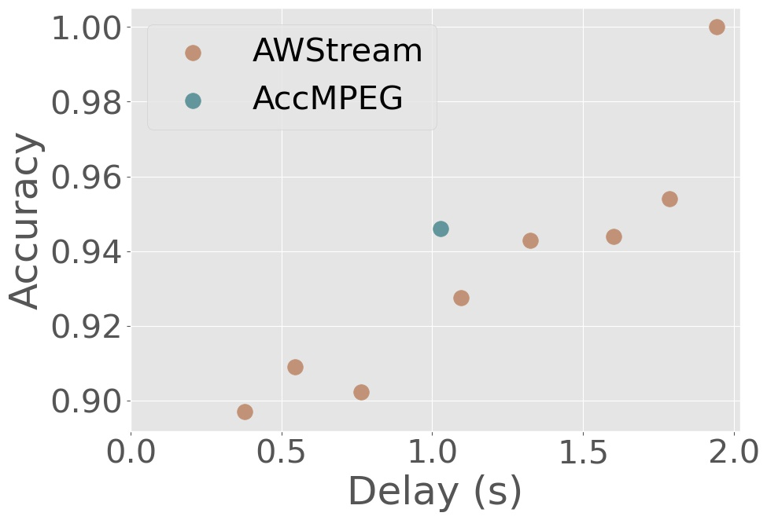
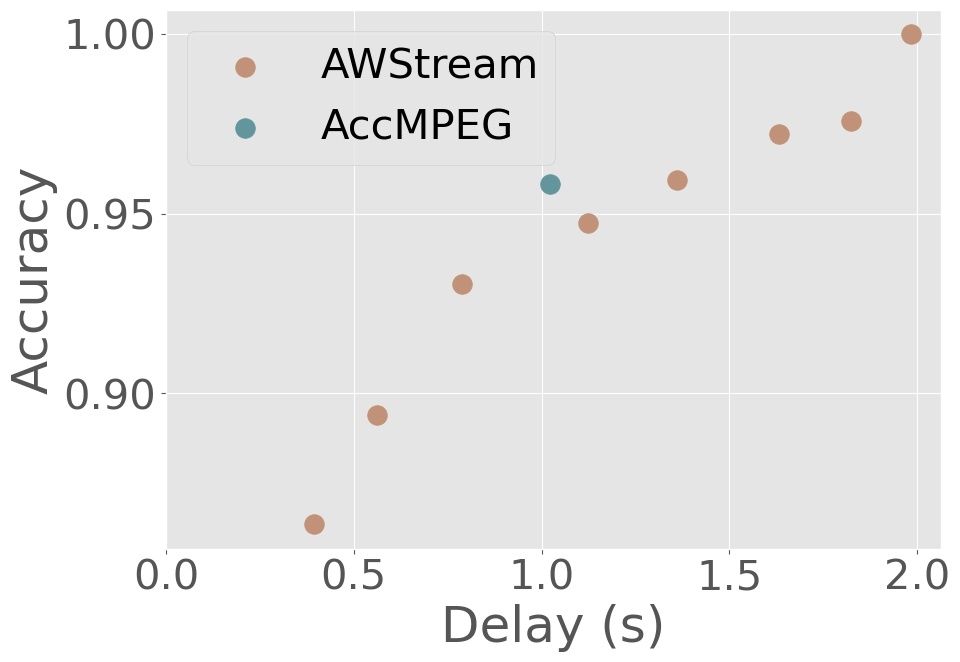

# video-compression

Here are the steps to run our code. We assume you start from a directory called $DIR, and your working machine contains an NVIDIA GPU.

## Build ffmpeg from source

Alex digged into the source code of ffmpeg and H.264 codec to support RoI encoding with an encoding quality (QP parameter in the H.264 codec) matrix file as the input. To build ffmpeg from source, please 
```bash
git clone https://github.com/Alex-q-z/myh264.git
```
under $DIR
and checkout to AccMPEG branch
```bash
git checkout AccMPEG
```

_(Note: this branch does not support parallel encoding. Please use the master branch if you want to use RoI encoding for other purposes.)_

After that, ```cd``` into the repo and run ```build.sh```. It takes time to compile. If you compiled the code successfully, you should see something like
```
INSTALL libavutil/libavutil.pc
```
at the end.

Then, inside x264/encoder/encoder.c, search for ```/tank```, and you'll see
```C++
    // Qizheng: add qp matrix file here
    h->operation_mode_file = x264_fopen("/tank/kuntai/code/operation_mode_file", "r");
    fscanf(h->operation_mode_file, "%d,", &h->operation_mode_flag);
    h->qp_matrix_file = x264_fopen("/tank/kuntai/code/qp_matrix_file", "r");
```
change the two hard-coded paths (/tank/kuntai/code/...) to $DIR/myh264/... (the path must be absolute path), and rerun build.sh (the compilation will take much less time this time, don't worry.)

## Set up conda environment

First, git clone our repo under $DIR and cd into our repo, then switch to MLSys branch:
```bash
git checkout MLSys
```

Then, install the conda environment through the ```conda_env.yml```:
```bash
conda env create -f conda_env.yml
```

Then, activate the installed environment:
```bash
conda activate accmpeg
```
and install pytorch ,torchvision (we use pytorch=1.8.2 when we replicate the results. Check https://pytorch.org/get-started/locally/ for the installation command) and detectron2 (check https://github.com/facebookresearch/detectron2/blob/main/INSTALL.md) **THROUGH PIP** rather than conda (since conda will install an ancient version of torchvision that triggers wierd bugs).

The procedure above will automatically install a old version ```ffmpeg```. We need to renew it. Please download the static version of ffmpeg through https://johnvansickle.com/ffmpeg/ and use the ffmpeg binary inside to replace previous ffmpeg binary (you can check the location of it thorugh ```which ffmpeg```.)

Then go back to our repo, ```cd artifact``` and run ```extract.py``` to extract the video ```dashcamcropped_1.mp4``` to pngs. 

## Edit the config file

Then, ```cd ..``` and open ```settings.toml```:
```bash
vim settings.toml
```
and edit the value of ```x264_dir``` to $DIR/myh264/

## Evaluate AccMPEG

Then run
```bash
python generate_mpeg_curve.py
```
That generates the data points for AWStream baseline.

(Note: this will take a while, please wait.)

Then run 
```bash
python batch_blackgen_roi.py
``` 
to run AccMPEG. 


Run
```bash
cd artifact/
```
to enter into the artifact folder, and then run
```bash
python plot.py
```
to plot the delay-accuracy trade-off. The results are shown in delay-accuracy.jpg. Here is the results (generated from the stats file we use for generating figures in our paper).



Note that the exact number may vary. Here is one figure reproduced by us under different server/ffmpeg version/CUDA version/torch version/torchvision version. 



## Run AccMPEG on multiple videos.

We put all the videos we used for object detection into ```artifact``` folder. To run these videos:
1. Extract all the videos to pngs through the ```extract.py``` inside the folder
2. Edit ```args.inputs``` in ```generate_mpeg_curve.py``` and run this script to generate AWStream baseline on these videos.
3. Edit ```v_list``` in ```batch_blackgen_roi.py``` and run the script to run AccMPEG.


